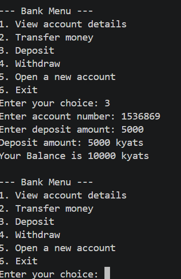
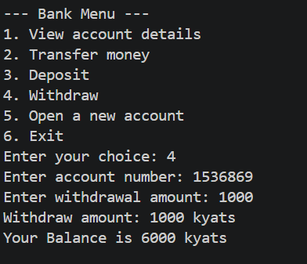
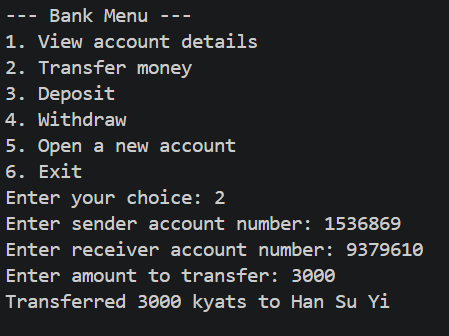

# 銀行管理システム (Bank Management System)

Javaで開発したコンソールベースの銀行管理システムです。
このプロジェクトでは、口座作成、入金、出金、送金、口座情報の確認などを行うことができます。

## 主な機能

* 新しい口座の作成
* 7桁の口座番号を自動生成
* 入金
* 出金
* 口座間送金
* 口座情報の表示
* システム終了

## 使用技術

* Java
* オブジェクト指向プログラミング (OOP)
* LinkedList
* BigDecimal
* Scanner

## ファイル構成

```text
Bank/
│
├── BankProgramming.java
├── Bank.java
├── Account.java
```

## 実行方法

### コンパイル

```bash
javac BankProgramming.java Bank.java Account.java
```

### 実行

```bash
java BankProgramming
```

## 📸 Screenshots

<table>
  <tr>
    <td align="center"><b>Home Page</b></td>
    <td align="center"><b>About Page</b></td>
  </tr>
  <tr>
    <td valign="top" align="center" style="height:300px;">
      
    </td>
    <td valign="top" align="center" style="height:300px;">
      
    </td>
  </tr>
  <tr>
    <td align="center"><b>Contact Page</b></td>
    <td align="center"><b>Login Page</b></td>
  </tr>
  <tr>
    <td valign="top" align="center" style="height:300px;">
      
    </td>
    <td valign="top" align="center" style="height:300px;">
      
    </td>
  </tr>
</table>

# 🏦 Bank Management System

## 🔗 Project Link

[Bank Management System を見る](https://github.com/w25019/Bank)

## 📝 概要

Javaで開発したコンソールベースの銀行管理システムです。
口座作成、入金、出金、送金、口座情報表示などの基本的な銀行機能を実装しました。

## 🛠 技術スタック

* Java
* OOP（オブジェクト指向プログラミング）
* LinkedList
* BigDecimal

## 💡 主な機能

* 7桁の口座番号を自動生成
* 新規口座作成
* 入金 / 出金
* 口座間送金
* 口座情報表示
* システム終了機能

## 🎯 工夫した点

* 重複しない口座番号を自動生成
* BigDecimalを利用して金額計算の精度を向上
* OOPを意識してクラスごとに役割を分割
* メニュー形式で直感的に操作できるよう設計

## 📸 Screenshots

<table>
  <tr>
    <td align="center"><b>Opening New Account</b></td>
    <td align="center"><b>View Account Details</b></td>
  </tr>
  <tr>
    <td valign="top" align="center" style="height:300px;">
      
    </td>
    <td valign="top" align="center" style="height:300px;">
      
    </td>
  </tr>
  <tr>
    <td align="center"><b>Deposit</b></td>
    <td align="center"><b>Withdraw</b></td>
  </tr>
  <tr>
    <td valign="top" align="center" style="height:300px;">
      
    </td>
    <td valign="top" align="center" style="height:300px;">
      
    </td>
  </tr>
    <tr>
    <td align="center"><b>Tansfer</b></td>
    <td align="center"><b>Checking After Transferring</b></td>
  </tr>
  <tr>
    <td valign="top" align="center" style="height:300px;">
      
    </td>
    <td valign="top" align="center" style="height:300px;">
      
    </td>
  </tr>


    <tr>
    <td align="center"><b>Incorrect withdraw</b></td>
  </tr>
  <tr>
    <td valign="top" align="center" style="height:300px;">
      
    </td>
  </tr>
</table>

## 学習した内容

* クラスとオブジェクト
* コンストラクタ
* メソッド
* カプセル化
* 繰り返し処理
* 条件分岐
* ランダムな口座番号生成
* LinkedListの利用

## 今後追加したい機能

* ファイルまたはデータベースへの保存
* ログイン機能
* GUI版の開発
* 取引履歴
* 利息計算機能

## 作成者

Yoon Ei Phyo
